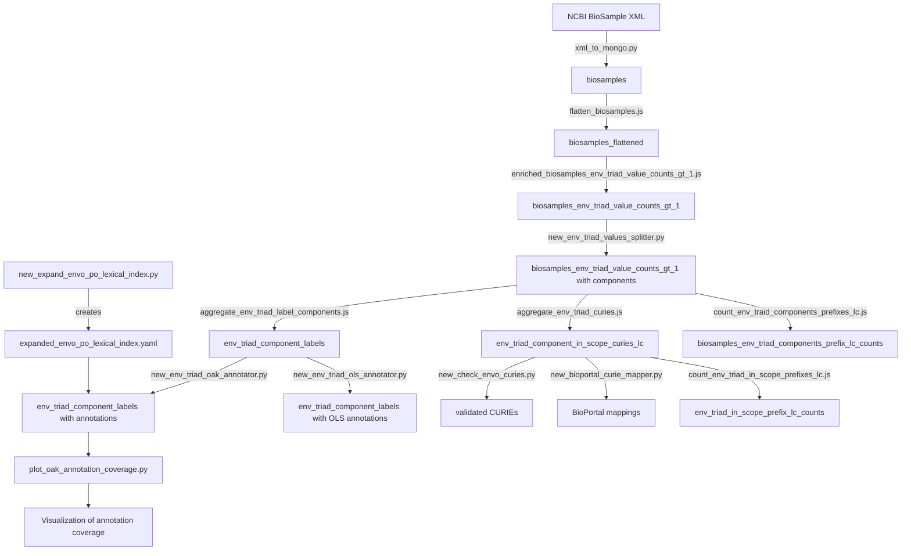

# Environmental Triad Context Value Processing Pipeline Report

## Overview

This report summarizes the data processing pipeline for environmental triad context values in the external-metadata-awareness repository. The pipeline extracts, normalizes, and enriches environmental context metadata fields (env_broad_scale, env_local_scale, env_medium) from NCBI BioSamples using MongoDB aggregation operations and Python-based ontology mapping tools.

## System Components

The system consists of several interconnected components:

1. **MongoDB Collections**: Define data structures as documented in `env_triad_annotation.yaml`
2. **MongoDB JavaScript Scripts**: Create and populate collections through aggregation operations
3. **Python Processing Scripts**: Enrich collections with ontology mappings and annotations
4. **Collection Inventory**: Documented in `env_triad_annotation-etc-collections.tsv` (formerly named `mongo-ncbi-loadbalancer-collections.tsv`)
5. **Lexical Index Files**: Large YAML files like `expanded_envo_po_lexical_index.yaml` that store OAK lexical annotation data

## Data Flow Architecture



## MongoDB Collections Schema (from YAML)

The YAML file `env_triad_annotation.yaml` defines these primary collections:

1. **biosamples**: Raw NCBI BioSample data
2. **biosamples_flattened**: Flattened view of biosamples with triad fields
3. **biosamples_env_triad_value_counts_gt_1**: Unique environmental values that appear ≥2 times
4. **biosamples_env_triad_components_prefix_lc_counts**: Counts of CURIE prefixes in components
5. **env_triad_component_in_scope_curies_lc**: Valid CURIEs extracted from triad values

Key relationships defined in the YAML:
- `biosamples.accession` maps to `biosamples_flattened.accession`
- Triad values map to the three environmental fields (broad_scale, local_scale, medium)
- Component prefixes and locals map to counts collections

## MongoDB JavaScript Files

These JavaScript files create and transform collections:

| Script | Input | Output | Purpose |
|--------|-------|--------|---------|
| `flatten_biosamples.js` | biosamples | biosamples_flattened | Extracts environmental fields |
| `enriched_biosamples_env_triad_value_counts_gt_1.js` | biosamples_flattened | biosamples_env_triad_value_counts_gt_1 | Aggregates unique values |
| `aggregate_env_triad_label_components.js` | biosamples_env_triad_value_counts_gt_1 | env_triad_component_labels | Extracts component labels |
| `aggregate_env_triad_curies.js` | biosamples_env_triad_value_counts_gt_1 | env_triad_component_in_scope_curies_lc | Extracts valid CURIEs |
| `count_env_traid_components_prefixes_lc.js` | biosamples_env_triad_value_counts_gt_1 | biosamples_env_triad_components_prefix_lc_counts | Counts CURIE prefixes |
| `count_env_triad_in_scope_prefixes_lc.js` | env_triad_component_in_scope_curies_lc | env_triad_in_scope_prefix_lc_counts | Counts validated prefixes |

## Python Processing Scripts

These Python files enhance the collections with ontology annotations:

| Script | Input Collection | Enhancement | External APIs |
|--------|------------------|-------------|--------------|
| `new_env_triad_values_splitter.py` | biosamples_env_triad_value_counts_gt_1 | Parses values to extract CURIEs and components | OBO Registry, BioPortal |
| `new_check_envo_curies.py` | env_triad_component_in_scope_curies_lc | Validates CURIEs against OAK ontology adapters | OAK |
| `new_expand_envo_po_lexical_index.py` | N/A | Creates and saves combined ENVO+PO lexical index | OAK |
| `new_env_triad_oak_annotator.py` | env_triad_component_labels | Annotates labels using ENVO/PO lexical index | OAK |
| `new_env_triad_ols_annotator.py` | env_triad_component_labels | Annotates labels using EBI OLS API | OLS API |
| `new_bioportal_curie_mapper.py` | env_triad_component_in_scope_curies_lc | Maps CURIEs to BioPortal terms and synonyms | BioPortal API |
| `plot_oak_annotation_coverage.py` | env_triad_component_labels | Visualizes the distribution of annotation coverage | None |
| `copy_database_without_compression.py` | Any collection | Copies collections between MongoDB instances | None |

## Collection Inventory (from TSV)

The `env_triad_annotation-etc-collections.tsv` (formerly `mongo-ncbi-loadbalancer-collections.tsv`) confirms the production deployment:

| Database | Collection | Source | Transformation | 
|----------|------------|--------|---------------|
| ncbi_metadata | biosamples | NCBI XML | load-biosamples-into-mongo |
| ncbi_metadata | biosamples_flattened | biosamples | flatten_biosamples.js |
| ncbi_metadata | biosamples_env_triad_value_counts_gt_1 | biosamples_flattened | enriched_biosamples_env_triad_value_counts_gt_1.js |
| ncbi_metadata | env_triad_component_labels | biosamples_env_triad_value_counts_gt_1 | aggregate_env_triad_label_components.js |
| ncbi_metadata | env_triad_component_in_scope_curies_lc | biosamples_env_triad_value_counts_gt_1 | aggregate_env_triad_curies.js |

## Pipeline Overview

The environmental triad annotation pipeline processes the three environmental context fields (env_broad_scale, env_local_scale, env_medium) from NCBI BioSamples through several sequential steps:

1. **Extract unique environmental triad values** from biosamples using MongoDB aggregations
2. **Parse and split** the values into components with the triad values splitter
3. **Identify CURIEs** (formal ontology identifiers) within the components
4. **Validate and normalize** the CURIEs against ontology resources
5. **Annotate text components** without CURIEs using lexical matching
6. **Combine annotations** from multiple sources and compute coverage metrics

## Detailed Workflow

### 1. MongoDB Aggregation Phase

MongoDB JavaScript files perform initial data extraction and organization:

#### `aggregate_env_triad_value_counts_gt_1.js` (not shown, presumed to exist)
- Creates the initial collection with unique values and their frequencies
- Filters to only keep values that appear multiple times

#### `aggregate_env_triad_curies.js`
- Extracts CURIEs from the components array in each document
- Filters for components with valid ontology prefixes (OBO or BioPortal)
- Creates normalized CURIE strings in lowercase (curie_lc field)
- Outputs to `env_triad_component_in_scope_curies_lc` collection

#### `aggregate_env_triad_label_components.js`
- Extracts text labels from the components array
- Computes statistics like count, label length
- Flags labels with lingering ENVO text or digit-only content
- Outputs to `env_triad_component_labels` collection

#### `count_env_traid_components_prefixes_lc.js`
- Counts all prefix occurrences including non-validated ones
- Creates a statistics collection `biosamples_env_triad_components_prefix_lc_counts`

#### `count_env_triad_in_scope_prefixes_lc.js`
- Counts only validated prefix occurrences
- Creates a statistics collection `env_triad_in_scope_prefix_lc_counts`

### 2. Python Processing Phase

Python scripts perform the detailed processing of environmental values:

#### `new_env_triad_values_splitter.py`
- Parses environmental triad values into component parts
- Identifies potential CURIEs using sophisticated regex patterns
- Handles multiple formats: bracketed CURIEs, pipe-separated lists, etc.
- Validates prefixes against OBO Foundry and BioPortal registries
- Updates documents with parsed components

Key features:
- Uses regex patterns to identify CURIEs:
  - `improved_curie_pattern`: Main pattern for standard format CURIEs
  - `bracketed_pattern`: For CURIEs within brackets
- Normalizes labels by lowercasing and removing punctuation
- Flags potential issues like digits-only identifiers or lingering ENVO text
- Validates prefixes against official ontology registries

#### `new_check_envo_curies.py`
- Validates extracted CURIEs against OAK ontology adapters
- Normalizes CURIE prefixes to canonical form (uppercase)
- Retrieves labels and obsolete status for each CURIE
- Updates the `env_triad_component_in_scope_curies_lc` collection

Key features:
- Supports 25+ ontologies via SQLite adapters
- Checks if terms are obsolete using OAK
- Provides error handling for failed lookups

#### `new_env_triad_oak_annotator.py`
- Uses a pre-built lexical index for text annotation
- Analyzes text labels to find ontology concept matches
- Computes coverage statistics for annotations
- Updates the `env_triad_component_labels` collection

Key features:
- Loads the expanded ENVO+PO lexical index from `expanded_envo_po_lexical_index.yaml`
- Filters out too-short and subsumed annotations
- Computes combined coverage metrics by merging overlapping regions
- Uses 1-based inclusive indexing for text spans

## Key Processing Steps

### 1. Collection Creation (MongoDB JS)

The process begins with MongoDB JavaScript files that:
- Flatten BioSample records into a tabular structure
- Extract and count unique environmental context values
- Generate component-level collections for labels and CURIEs

The JavaScript files are executed directly on the MongoDB server through the Mongo shell, enabling efficient aggregation operations.

### 2. Component Parsing (Python)

`new_env_triad_values_splitter.py` performs detailed parsing:
- Extracts CURIEs (e.g., "ENVO:00002006") from environmental strings
- Identifies bracketed terms: "[ENVO:00002006]" or "(PO:0025034)"
- Validates prefixes against OBO Registry and BioPortal
- Adds `components` field with structured information to the collection

### 3. Lexical Index Creation & Ontology Annotation (Python)

The process creates a lexical index for annotation and uses it to map terms:

- `new_expand_envo_po_lexical_index.py` creates a combined ENVO+PO lexical index:
  - Creates a punctuation-insensitive lexical index for both the ENVO and PO ontologies
  - Adds obsolete terms with their "obsolete" prefix removed
  - Includes additional entries with punctuation replaced by whitespace
  - Merges both ontology indexes and saves as `expanded_envo_po_lexical_index.yaml` (6.5MB file)

- Multiple annotation scripts provide ontology term mapping:
  - `new_check_envo_curies.py` validates CURIEs against ontology adapters
  - `new_env_triad_oak_annotator.py` uses the lexical index for text annotation
  - `new_env_triad_ols_annotator.py` queries OLS API for exact term matches
  - `new_bioportal_curie_mapper.py` retrieves BioPortal mappings for terms
  - `plot_oak_annotation_coverage.py` visualizes the coverage statistics

The annotation adds labels, synonyms, obsolete status flags, and ontology mappings to the collections. API errors are logged to `bioportal_class_mapping_errors.txt`, which contains the terminal output from the most recent run.

## Key Files

The system relies on these files:

1. **Python Scripts**:
   - `new_env_triad_values_splitter.py`: Main script for parsing values into components
   - `new_check_envo_curies.py`: Validates CURIEs against ontology resources
   - `new_env_triad_oak_annotator.py`: Performs text annotation using lexical indexes

2. **MongoDB JS Aggregations**:
   - `aggregate_env_triad_curies.js`: Extracts CURIEs from components
   - `aggregate_env_triad_label_components.js`: Processes text labels
   - `count_env_traid_components_prefixes_lc.js`: Counts all prefix occurrences
   - `count_env_triad_in_scope_prefixes_lc.js`: Counts validated prefix occurrences

3. **Support Files**:
   - `expanded_envo_po_lexical_index.yaml`: Pre-built lexical index combining ENVO and PO ontologies

## Ontology Resources

The pipeline uses multiple ontology resources:

1. **OBO Foundry Ontologies**: Accessed via OAK SQLite adapters (25+ ontologies)
2. **BioPortal Ontologies**: Validated against the BioPortal API
3. **Local Lexical Indexes**: Custom-built for efficient text annotation

## File Relationships

The key files and their relationships in the current environmental triad processing pipeline:

```
MongoDB Collections                 MongoDB JS Scripts                 Python Scripts
-------------------                 ------------------                 --------------
biosamples_env_triad_value_counts_gt_1 <-- aggregate_env_triad_value_counts_gt_1.js (not shown)
         |                                     ^
         v                                     |
         |--- aggregate_env_triad_curies.js ---+
         |            |
         |            v
         |   env_triad_component_in_scope_curies_lc
         |            |
         |            |--- count_env_triad_in_scope_prefixes_lc.js
         |            |           |
         |            |           v
         |            |    env_triad_in_scope_prefix_lc_counts
         |            |
         |            |--- new_check_envo_curies.py
         |                        |
         |                        v
         |            (validated CURIEs with labels)
         |
         |--- aggregate_env_triad_label_components.js
         |            |
         |            v
         |    env_triad_component_labels
         |            |
         |            |--- new_env_triad_oak_annotator.py
         |                        |
         |                        v
         |            (text annotations with coverage stats)
         |
         |--- count_env_traid_components_prefixes_lc.js
                      |
                      v
        biosamples_env_triad_components_prefix_lc_counts
```

#### BioPortal Mapping Challenges

Analysis of the error log reveals several recurring issues:

1. **Permission-Related Errors**: Most errors are 403 Forbidden responses, indicating access restrictions for specific ontologies
   - The Drosophila anatomy ontology (`FBBT-C`) is consistently problematic, with most errors relating to terms from this prefix
   - Other ontologies like `TEST_BAO` and `NCBITAXON-GNA` also generate 403 errors

2. **Problematic CURIE Prefixes**: The following prefixes show recurring issues:
   - **Anatomy Ontologies**: FBBT (FlyBase), UBERON, and VTO (Vertebrate Taxonomy) terms
   - **Non-Standard Prefixes**: The "of:" prefix (possibly "Ontology of Functions") appears frequently and may represent non-standard CURIEs
   - **Plant Ontology**: Certain PO terms also encounter mapping challenges
   - **SNOMED CT**: SNOMED CT terms may be missed because of prefix inconsistency - some systems expect "SNOMED" as the prefix while others use "SNOMEDCT", leading to mapping failures

These patterns suggest that BioPortal API access may be restricted for certain ontologies, and that non-standard prefixes like "of:" require special handling in the mapping process. Additionally, prefix normalization for well-known ontologies with multiple prefix versions (such as SNOMED CT) would improve mapping success rates.

## Historical Context

This process evolved from earlier Jupyter notebooks in the `ncbi_annotation_mining` folder. The sequence of development was:

1. `biosample_flattening_etc_cleanup.ipynb`: Initial data preparation
2. `flatten_all_ncbi_biosample_harmonized_attributes.ipynb`: Created flat representation
3. `extract_and_parse_env_triad_values.ipynb`: First extraction of values
4. `lexical_index_functions.ipynb`: Utilities for lexical index management
5. `build_and_apply_lexical_index_from_env_triad_values_ner.ipynb`: Applied NER to triad values
6. `compact_mined_triads.ipynb`: Created optimized representation

The current Python scripts represent a more efficient, production-ready implementation of this workflow.

## Known Challenges

Several challenges exist in this pipeline:

1. **Prefix Validation**: Some valid ontology prefixes like "ENV" or "ENV0" are still not properly handled
2. **CURIE Format Variations**: The system must handle multiple formats and separators
3. **BioPortal Mapping Errors**: Some ontologies in BioPortal cause mapping errors
4. **Coverage Computation**: Requires sophisticated handling of overlapping text regions

## Execution Sequence

To run the complete pipeline:

1. Set up MongoDB with biosamples data and create the `biosamples_env_triad_value_counts_gt_1` collection
2. Run the MongoDB aggregation scripts in this order:
   - `aggregate_env_triad_curies.js`
   - `aggregate_env_triad_label_components.js`
   - `count_env_traid_components_prefixes_lc.js`
   - `count_env_triad_in_scope_prefixes_lc.js`
3. Execute the Python scripts:
   - `new_env_triad_values_splitter.py`
   - `new_check_envo_curies.py`
   - `new_env_triad_oak_annotator.py`

## Lexical Index Creation and Usage

The system uses lexical indexes for efficient text annotation:

1. **Index Creation**: Using `create_lexical_index()` from OAK
2. **Index Loading**: Using `load_lexical_index()` from file
3. **Text Annotation**: Using the `TextAnnotatorInterface` class
4. **Index Merging**: Multiple ontology-specific indexes are merged into a combined index

The `expanded_envo_po_lexical_index.yaml` file (6.5MB) contains the combined lexical index that enables efficient matching of text strings to ontology concepts from both ENVO and PO ontologies.

## Configuration Notes

1. **MongoDB Connection**:
   - The scripts use various connection patterns:
     - Default: localhost:27017
     - Remote access with authentication using environment variables 
     - NERSC cluster connection: mongo-ncbi-loadbalancer.mam.production.svc.spin.nersc.org

2. **Ontology Adapters**:
   - OAK adapters configured with SQLite connections (sqlite:obo:envo pattern)
   - Supports 25+ ontologies (ENVO, PO, UBERON, etc.)
   - Registry information pulled from OBO Foundry and BioPortal

3. **Caching**:
   - Request caching implemented for OBO Foundry and BioPortal API calls
   - Cache duration: 1 hour (3600 seconds)
   - Cache location: `new_env_triad_values_splitter_cache.sqlite`

## Production Implementation

According to the TSV inventory:
- The pipeline runs on a production server (mongo-ncbi-loadbalancer)
- Some steps may run on NERSC's Perlmutter supercomputer
- Both older and newer versions of scripts may be maintained
- Some collections in the YAML or used by Python scripts are not explicitly listed

For database operations:
- `copy_database_without_compression.py` facilitates moving collections between MongoDB instances
- It handles MongoDB's compression settings while maintaining data integrity
- This enables database migrations and backup/restore operations for the pipeline

## Output and Applications

The pipeline produces:
1. Normalized environmental context values
2. Mapping of values to standard ontology terms
3. Coverage metrics for term annotation
4. Cross-ontology mappings for interoperability

These outputs feed into:
- Voting sheets for environmental context standardization (mentioned in CLAUDE.md)
- LinkML enumerations for the submission-schema repository
- Ontology term recommendations for EnvO and other ontologies

## Supporting Files

Several additional files support the pipeline's functionality:

1. **Schema Files**:
   - `env_triad_annotation.yaml`: Defines the MongoDB schema for environmental triad collections
   - Used for documenting collection relationships and field definitions

2. **Lexical Index Files**:
   - `expanded_envo_po_lexical_index.yaml`: Large (6.5MB) file containing the combined lexical index
   - Created by `new_expand_envo_po_lexical_index.py`
   - Used by `new_env_triad_oak_annotator.py` for text annotation

3. **Error Logs**:
   - `bioportal_class_mapping_errors.txt`: Logs errors encountered during BioPortal API requests
   - Contains the terminal output buffer from the most recent run of `new_bioportal_curie_mapper.py`
   - Used for debugging and monitoring the BioPortal mapping process
   - Shows patterns of access restrictions and problematic ontology prefixes

4. **Collection Inventory**:
   - `env_triad_annotation-etc-collections.tsv`: Comprehensive inventory of MongoDB collections
   - Renamed from `mongo-ncbi-loadbalancer-collections.tsv`
   - Documents source, transformation steps, and database location for collections

## Conclusion

The environmental triad context value processing pipeline provides a comprehensive system for extracting, normalizing, and mapping environmental metadata in NCBI BioSamples. It transforms unstructured text fields into standardized ontology terms through a combination of MongoDB aggregation and Python-based ontology annotation, supporting FAIR (Findable, Accessible, Interoperable, Reusable) metadata practices for environmental contexts in biological sample records.

The pipeline's modular architecture allows for incremental improvements, with specialized components for parsing, annotation, and mapping. The recent addition of lexical index expansion, annotation coverage visualization, and improved database operations further enhances the system's capabilities for standardizing environmental context values across biological datasets.