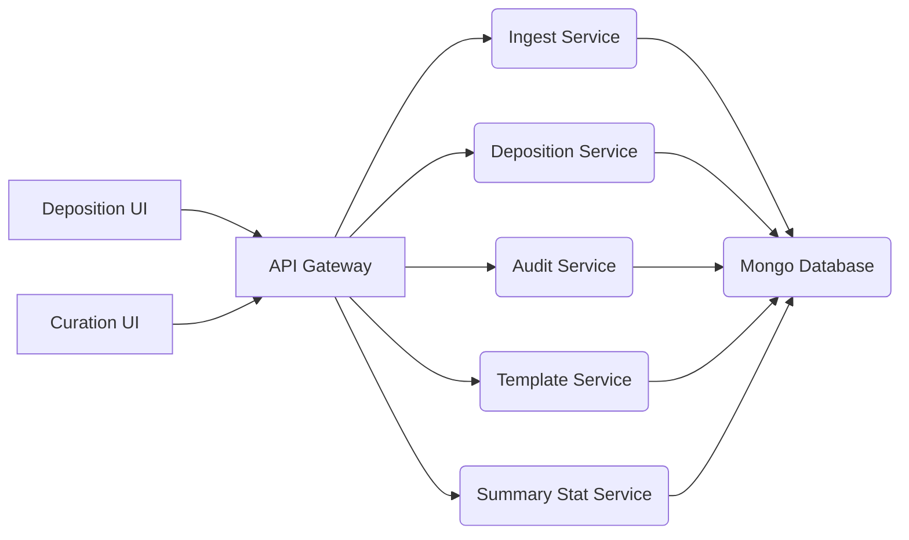

  
  
## GWAS Curation Service  
This is the new GWAS Curation Back End Microservice created to provide features for supporting the curation of GWAS metadata and summary statistics files searchable and downloadable from the  NHGRI-EBI GWAS Catalog. It provides secure endpoints for accessing the GWAS databases in order to change, edit, annotate and curate user submitted metadata and summary statistics. This software runs alongside other components of the GWAS Deposition Microservices system such as the Template service and GWAS Deposition Service e.t.c as shown below:  
  
## Service Interactions  

- [Ingest Microservice](https://github.com/EBISPOT/gwasdepo-ingest-service)
- [Deposition Microservice](https://github.com/EBISPOT/gwasdepo-deposition-service)
- [Audit Microservice](https://github.com/EBISPOT/gwasdepo-audit-service)
- [Template Microservice](https://github.com/EBISPOT/gwas-template-services)
- [Summary Stat Microservice](https://github.com/EBISPOT/gwas-sumstats-service)
- [Curation UI](https://github.com/EBISPOT/gwas-curation-ui)
- [Deposition UI](https://github.com/EBISPOT/gwas-deposition-ui)

  
## Requirements  
  
Before you begin, ensure you have met the following requirements:  
  
- You have a MacOSX/Linux/Windows machine.   
- You have Java 8 installed.   

## Deploying this service locally  
1. Install Java and JDK8 
1. Clone the application from https://github.com/EBISPOT/gwas-curation-service.git
1. Run `mvn clean install` to build the application and generate executable jar 
1. The application uses default profile as `local` 
1. You need to supply 2 program arguments 
    
    | Program Argument | Possible Values | Implication |
    | ------           | ------          |------       |
    | `auth-enable`    | true or false   | Enable or Disable Authentication|
    | `mongo-server`   | mongodb-url:port   | Mongo Database URL|

1. Run `java -jar gwas-curation-service.jar --auth-enable=false --mongo-server=mongodb-url:port` to launch app using default local application 

## Running from Intellij 
1. After step 2 above 
1. Go to Run > Edit Configurations 
1. A dialog box will appear. 
1. Insert in the VM Options text field: -Dmongo-server={mongo-db-server-url} -Dauth-enable={true or false} -Dftp-user=... -Dftp-pass=... -Dftp-link=...
1. Insert in the Environment Variable text Field: DB_USER={mongo-database-user} DB_PASSWORD={mongo-database-password}
1. Access the app on url: http://localhost:{server:port}/{server:servlet:context-path}/v1 as specified in the application-local.yaml property file e.g http://localhost:8081/gwas/depo-curation/api/v1/ 
 
### Contributing  
  
Submitting changes to the data follows this workfow:  

1. Create a branch with using issue number and brief issue description using [kebab-case](https://medium.com/better-programming/string-case-styles-camel-pascal-snake-and-kebab-case-981407998841), eg. `git checkout -b 'iss-3-curation-edit-file'`  
1. Do the work to fix the issue or add a new feature and commit message as appropriate 
    - Summarize the change in less than 50 characters  
    - Because: - Explain the reasons you made this change 
    - Make a new bullet for each reason - Each line should be under 72 characters  
    - Explain exactly what was done in this commit with more depth than the 50 character subject line. Remember to wrap at 72 characters! 
1. Push local changes to the remote feature branch   
1. Create a Pull Request to merge the updates in the feature branch into `develop` branch
1. Once the changes are merged into `develop` branch, the Gitlab plan will automatically deploy these changes to the Kubernetes sandbox environment where User Acceptance Testing can be done
1. When the UAT is completed successfully, the updates in `develop` can be merged into `master`, either through a Pull Request or using git merge from your local repo    

### Contributors  
  
- Check the contribution section [here](https://github.com/EBISPOT/gwas-curation-service/graphs/contributors) 
  
### Troubleshooting  
  
If something goes wrong, please check the logs.
