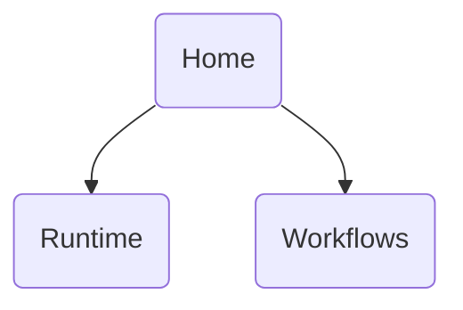
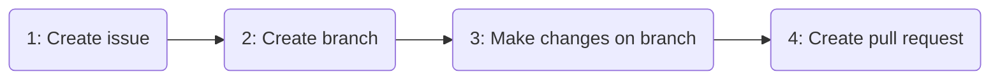

# Docs

## Introduction

This repository underlies the NMDC [documentation website](https://docs.microbiomedata.org).

The NMDC documentation website is made up of three sections: Home, Runtime, and Workflows. The content for some of those
sections resides in this repository, while the content for others of those sections resides in other repositories.
The NMDC documentation website is generated by pulling in the remote content, compiling each section on its own,
and then merging all the compiled sections into a single website.

## Table of contents

<!-- TOC -->
* [Docs](#docs)
  * [Introduction](#introduction)
  * [Table of contents](#table-of-contents)
  * [Repository structure](#repository-structure)
  * [Content Editor Quick Reference ✍️](#content-editor-quick-reference-%EF%B8%8F)
  * [The Home section](#the-home-section)
    * [Making changes](#making-changes)
      * [Basic workflow (to edit 1 file)](#basic-workflow-to-edit-1-file)
      * [Intermediate workflow (to edit 1+ files)](#intermediate-workflow-to-edit-1-files)
  * [Developer documentation](#developer-documentation)
<!-- TOC -->

## Repository structure

The repository has the following top-level directories:

- `.docker/` - this directory contains files only used in the Docker-based development environment
- `.github/` - this directory contains GitHub Actions workflow specifications
- `content/` - this directory contains the source files for the Home section of the website
- `pullers/` - this directory contains files related to pulling and compiling remote content into the website

Some of those top-level directories have their own `README.md` files, which further describes the directory's contents.

## Content Editor Quick Reference ✍️

Here is a table showing the locations of files you can edit in order to make changes to a given section of the website:

| To edit content in this section... | Edit files in this folder...                                                                               |
|---------------------------------------|---------------------------------------------------------------------------------------------------------------|
| Home                                  | The `content/home` folder in this repo                                                                        |
| Runtime                               | The `docs` folder in [the `nmdc-runtime` repo](https://github.com/microbiomedata/nmdc-runtime/tree/main/docs) |
| Workflows › Overview                  | The `pullers/workflow_docs` folder in this repo                                                               |
| Workflows › Index                     | The `pullers/workflow_docs` folder in this repo                                                               |
| Workflows › Chapter 1                 | The `pullers/workflow_docs/metagenome_workflow_overview` folder in this repo                                  |
| Workflows (Other)                     | The `docs` folder in [the respective workflow's repo](https://github.com/orgs/microbiomedata/repositories)    |

> **Note:** As an alternative to using the table above, you can click on the "Edit on GitHub" links
> throughout the website.

Here is a diagram showing the repositories (bottom) each section of the website (top) gets its content from.

```mermaid
flowchart BT
    docs_repo[("docs<br>repo")]
    home_section("Home")
    docs_repo --> home_section
    
    runtime_section("Runtime")
    runtime_repo[("nmdc-runtime<br>repo")]
    runtime_repo --> runtime_section
    
    workflows_section("Workflows")
    ReadsQC_repo[("ReadsQC<br>repo")]
    ReadbasedAnalysis_repo[("ReadbasedAnalysis<br>repo")]
    metaAssembly_repo[("metaAssembly<br>repo")]
    mg_annotation_repo[("mg_annotation<br>repo")]
    metaMAGs_repo[("metaMAGs<br>repo")]
    metaT_repo[("metaT<br>repo")]
    metaT_ReadsQC_repo[("metaT_ReadsQC<br>repo")]
    metaT_Assembly_repo[("metaT_Assembly<br>repo")]
    metaT_ReadCounts_repo[("metaT_ReadCounts<br>repo")]
    metaPro_repo[("metaPro<br>repo")]
    metaMS_repo[("metaMS<br>repo")]
    enviroMS_repo[("enviroMS<br>repo")]
    docs_repo --> workflows_section
    ReadsQC_repo --> workflows_section
    ReadbasedAnalysis_repo --> workflows_section
    metaAssembly_repo --> workflows_section
    mg_annotation_repo --> workflows_section
    metaMAGs_repo --> workflows_section
    metaT_repo --> workflows_section
    metaT_ReadsQC_repo --> workflows_section
    metaT_Assembly_repo --> workflows_section
    metaT_ReadCounts_repo --> workflows_section
    metaPro_repo --> workflows_section
    metaMS_repo --> workflows_section
    enviroMS_repo --> workflows_section
```

The website will automatically be regenerated and redeployed whenever a new commit is made on—or merged into—the `main`
branch of _this_ repository. Regeneration includes pulling content from the remote repositories. The regeneration and redeployment process usually takes about three minutes to complete.

## The Home section

The `content/home/` directory contains the source files for the Home section of the website. That directory began as an
almost 1-to-1 copy of the `NMDC_documentation` repository. More information about what was—and wasn't—copied is
available [here](./content/home/README.md).
This section of the website is generated using [MkDocs](https://www.mkdocs.org/), a static site generator.
Its content is organized according to the [Diátaxis](https://diataxis.fr/how-to-use-diataxis/#use-diataxis-as-a-guide-not-a-plan) guidelines.

### Making changes

Here's how you can make (technically, "propose") a change to this section of the website:

**Note:** The high-level process may be familiar to you: (1) create a GitHub Issue, (2) create a branch associated
with that Issue, (3) make changes on that branch, and (4) create a Pull Request to merge that branch into `main`.

You can use whatever workflow you want in order to do those things. The following are some example workflows we've
documented for our teammates.

#### Basic workflow (to edit 1 file)

  
Show/hide steps

1. Create a GitHub Issue describing the issue you want to address (e.g. "`Link is broken`")
2. On GitHub, go to the file within `content/home/src` that you want to edit
3. Click the "Edit this file" button (i.e. the pencil icon button) at the upper right
4. Edit the file, making the changes you want to make
5. Click the "Commit changes..." button at the upper right
6. Customize the commit message to tell others what you did (e.g. "`Fix typo in link`")
7. Mark the bubble that says "**Create a new branch** for this commit and start a pull request"
8. (Recommended) Customize the branch name so it starts with the GitHub Issue number (e.g. `123-link-is-broken`)
9. Click "Propose changes"
10. Fill in the Pull Request form and click "Create pull request"

You will end up with a Pull Request (PR) containing the changes. Once the PR gets merged into `main`,
the documentation website will automatically be updated to reflect the changes you made.

#### Intermediate workflow (to edit 1+ files)

  
Show/hide steps

1. Create a GitHub Issue describing the issue you want to address (e.g. "`Link is broken`")
2. Visit https://github.dev/microbiomedata/docs/
3. Click the branch name (e.g. `main`) at the lower left
4. Click "Create a new branch..." at the top
5. Enter a name for the branch, beginning with an issue number (e.g. `123-link-is-broken`)
6. (If prompted) Click "Switch to Branch"
7. Make changes in `content/home/src`
8. Click the "Source Control" icon in the left sidebar (3rd from the top)
9. Hover over the "Changes" heading and click the `+` icon that appears
10. Enter a commit message to tell others what you did (e.g. "`Fix typo in link`")
11. Click the "Commit & Push" button
12. Visit https://github.com/microbiomedata/docs/ and create a Pull Request for that branch

You will end up with a Pull Request (PR) containing the changes. Once the PR gets merged into `main`,
the documentation website will automatically be updated to reflect the changes you made.

## Developer documentation

Developer documentation is in [development.md](./development.md).
