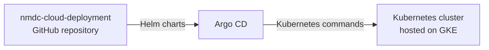

# nmdc-cloud-deployment

> [!NOTE]
> This is a private repository.

## Overview

This repository contains helm charts and Kubernetes resource specification files
used to maintain the NMDC instance hosted on Google Cloud Platform (GCP).

## Repository contents

Here's a brief description of each top-level directory in the repository:

- `certs`: YAML files related to creating certificates for
  [ingress](https://kubernetes.io/docs/concepts/services-networking/ingress/) resources
- `helm-charts`: Helm charts used by [Argo CD](https://argo-cd.readthedocs.io/en/stable/)
  to deploy resources to the Kubernetes cluster hosted on
  [GKE](https://cloud.google.com/kubernetes-engine/)
- `secret-manager`: YAML files related to managing Kubernetes secrets
  via an [external-secrets](https://external-secrets.io/) controller

## Deployments

### Applications

- [Data Portal](https://data-backup.microbiomedata.org)
- [Runtime](https://api-backup.microbiomedata.org)
- [Dagit (Dagster UI)](https://dagit-backup.microbiomedata.org)

### Infrastructure management tools

- [GitHub](https://github.com/microbiomedata/nmdc-cloud-deployment)
- [Argo CD](https://argocd.microbiomedata.org)
- [Google Cloud](https://console.cloud.google.com/welcome?project=nmdc-377118)

## Argo CD

### Overview

[Argo CD](https://argo-cd.readthedocs.io/en/stable/) is an open-source, continuous delivery tool for Kubernetes.
It is similar to [Rancher](https://www.rancher.com/) in the sense that it provides a _non_-command-line way of
managing Kubernetes resources.

We use Argo CD to:

- View container logs
- View a visual representation of the Kubernetes cluster
- Pull Helm charts from this repository and apply them to that Kubernetes cluster

That third thing—called a "sync" operation—is depicted here:



### Updating an application

Updating an application involves editing its helm chart (located in this repository), then
triggering a "sync" operation on Argo CD.

#### Editing a helm chart

Here's how you can edit a helm chart:

1. Clone this repository (or edit its contents directly on GitHub)
2. In the `helm-charts` directory, locate the directory associated with the application you want to update
3. In its `values.yaml` file, locate the section associated with the service you want to modify
4. In that section, update the `image` object to reflect the container image associated with the updated application
   ```diff
     some_service:
       image:
         repository: ghcr.io/microbiomedata/my-app-some-service
   -     tag: "1.2.3"
   +     tag: "1.2.4"
   ```
5. Commit the change to the repository (e.g. via a pull request)

#### Triggering a "sync" operation

Here's how you can trigger a "sync" operating in Argo CD:

1. Login to [Argo CD](https://argocd.microbiomedata.org)
   using a GitHub user account that is on the `argo-admin` team (or "higher")
2. In the sidebar on the left, click the "Applications" link
3. On the card associated with the application you want to update, click the "Sync" button
4. In the sidebar that appears, click the "Synchronize" button at the top
5. Sit back and relax as Argo CD pulls the latest helm charts from this GitHub repository
   and applies them (including the changes you made earlier) to the Kubernetes cluster

> Note: Argo CD does have an _automatic "sync"_ feature; but we have intentionally _not_ enabled it.
> We'll revisit the possibility of enabling it once team members are familiar with the rest of the setup.

### Viewing application logs

1. Login to [Argo CD](https://argocd.microbiomedata.org)
   using a GitHub user account that is on the `argo-devops` team (or "higher")
2. In the sidebar on the left, click the "Applications" link
3. Click on the card associated with the application whose logs you want to view
4. (Optional) In the upper right corner of the page, click the icon that looks like computers on a network
    - This will set the view to "Application Details Network"
5. Click on the pod whose logs you want to view
6. In the sidebar that appears, click the "Logs" tab at the top
    - The logs will appear

You can visit our Argo CD instance [here](https://argocd.microbiomedata.org).

### Access

We use GitHub [teams](https://github.com/orgs/microbiomedata/teams) to manage access to—and permissions on—Argo CD.

The teams we use are:

| Team name         | Team members can do this on Argo CD |
|-------------------|-------------------------------------|
| `argo-superadmin` | Everything                          |
| `argo-admin`      | Modify resources                    |
| `argo-devops`     | View resources                      |

GitHub users that are a member of one of those teams will have the associated permissions on Argo CD.

## Dagit (Dagster UI)

### Overview

Dagit is the web-based user interface of [Dagster](https://docs.dagster.io/).

> I think the maintainers of Dagster want people to refer to the Dagster UI as
> "[the Dagster UI](https://docs.dagster.io/concepts/webserver/ui)" nowadays,
> instead of as "[Dagit](https://github.com/dagster-io/dagster/issues/14873#issue-1765753092)".
> I'll still refer to it as "Dagit" here, in an attempt to be consistent with the
> [nmdc-runtime](https://github.com/microbiomedata/nmdc-runtime/) repository.

You can visit our Dagit instance [here](https://dagit-backup.microbiomedata.org).

### Access

We use Google's [Identity-Aware Proxy (IAP)](https://cloud.google.com/security/products/iap) to manage access to Dagit.

#### Granting access

Here's how you can grant someone access to Dagit:

> [!NOTE]
> Only an IAP Policy Admin can perform these steps.

1. Go to the [Identity-Aware Proxy](https://console.cloud.google.com/security/iap?project=nmdc-377118) page on
   Google Cloud console
2. In the "Resource" column, click on `nmdc-test/dagster-dagit-service`
3. In the sidebar on the right, click the "Add Principal" button
4. Enter the email address of the Google account you want to grant access to
5. Select the role named `IAP-secured Web App User`
6. Click the "Save" button

#### Revoking access

> [!NOTE]
> Only an IAP Policy Admin can perform these steps.

1. Go to the [Identity-Aware Proxy](https://console.cloud.google.com/security/iap?project=nmdc-377118) page on
   Google Cloud console
2. In the "Resource" column, click on `nmdc-test/dagster-dagit-service`
3. In the sidebar on the right, click the trash can icon next to the Google account whose access you want to revoke


    


 

