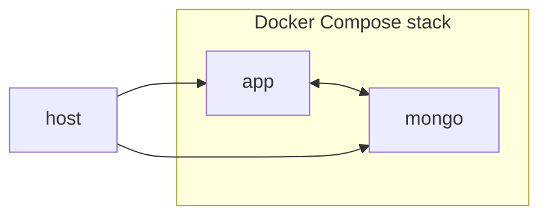

# nmdc-mongo-migration-demo

This repository contains code and documentation that you can use to demonstrate the migration of a Mongo database.

## Docker Compose Stack

Here's a diagram of the Docker Compose stack defined in `docker-compose.yml`. It also shows the Docker host (i.e. the computer running Docker).



## Usage

Here's how you can perform the demonstration.

1. Clone this repository onto your computer and go into its root folder.

   ```shell
   git clone https://github.com/microbiomedata/nmdc-mongo-migration-demo.git
   cd nmdc-mongo-migration-demo
   ```

1. If something on your host machine is already listening on port `27017` (or you just want to keep that port free), edit `docker-compose.yml` so the `mongo` service is mapped to a different port on your local machine (one that nothing is listening on). For example, if `localhost:27017` is in use, but `localhost:27027` is available:

   ```diff
   -    ports: ["27017:27017"]
   +    ports: ["27027:27017"]
   ```

   > In contrast, you don't have to edit the port number in the `config.ini` file, since that file will only be used by the `app` service and not by the Docker host (unless you deviate from these instructions).

1. Spin up the Docker Compose stack.

   ```shell
   docker compose up --detach
   ```

   > The `--detach` (`-d`) option makes it so your terminal doesn't connect to the output of the containers; instead, keeping it usable for the remaining steps.

1. (Optional) Connect a graphical MongoDB client to the `mongo` container.

   > The hostname will be "`localhost`" and the authentication database name will be "`admin`". You can get the port number (default: `27017`), username (default: `admin`), and password (default: `root`) from `docker-compose.yml`.

1. Run a `bash` shell in the `app` container and attach your terminal to it.

   ```shell
   docker compose exec app bash
   ```

1. (Optional) In the `app` container: View the contents of the `config.ini` file.

   ```shell
   cat config.ini
   ```

   > That's the file from which the migration tool, `mongodb-migrate`, will get its configuration.
   >
   > You can run `mongodb-migrate --help` to see a list of CLI options you can use to override the things defined in the configuration file.

1. (Optional) In the `app` container: View the contents of the `migrations` folder.

   ```shell
   ls -1 migrations/ | grep '\.py$'
   ```

   > That's the folder in which the migration scripts are stored.
   >
   > I recommend `cat`-ing each migration script to see what it does.

1. In the `app` container: Apply the migrations.

   ```shell
   mongodb-migrate
   ```

   > That will execute the `upgrade` function in each not-yet-applied migration script, in order from oldest to newest (in terms of the timestamp in the filename).
   >
   > It will also update the `_migrations` collection in the database with some migration status information.

1. In the `app` container: Roll back the migrations.

   ```shell
   mongodb-migrate --downgrade
   ```

   > That will execute the `downgrade` function in each already-applied migration script, in order from newest to oldest (in terms of the timestamp in the filename).
   >
   > It will also update the `_migrations` collection in the database with some migration status information.

Want to create a migration script? Check out the [README.md](./migrations/README.md) file in the migrations folder.

## Dependencies

The app's direct dependencies are:

- `mongodb-migrations` ([GitHub](https://github.com/DoubleCiti/mongodb-migrations))

The `requirements.txt` file contains a list of all of the app's dependencies (including dependencies of dependencies).
